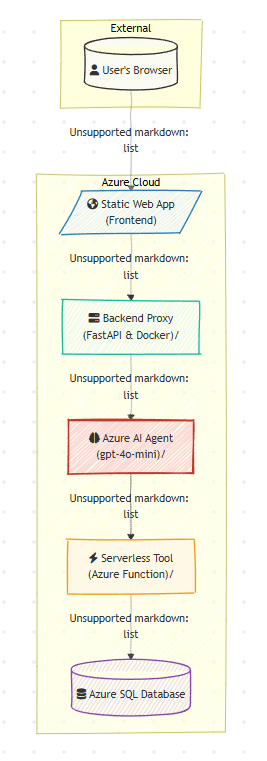

# Full-Stack AI Business Website & Secure Cloud Architecture

This repository contains the frontend and backend proxy for a complete, full-stack, AI-powered web application. The project was conceived and built as a comprehensive portfolio piece to demonstrate professional competency in modern cloud architecture, full-stack development, AI integration, and security best practices on Microsoft Azure.

The live application provides a seamless user experience with two core features unified through a single chat interface:
1.  **AI-Powered Conversational Q&A** on business topics.
2.  **Live, Typo-Tolerant Order Status Lookups** against a secure database.

## 🚀 Live Demo


## Architecture Overview

The application is built with a modern, decoupled, and secure architecture. A static frontend communicates with a custom Python backend that acts as a **secure proxy**. This proxy intelligently routes requests to the appropriate Azure service, ensuring that no sensitive credentials or complex logic are ever exposed to the client-side.

### Logical Flow

This diagram shows the high-level logical flow of a user request through the main application components.



### Network & Security Architecture

For a detailed, physical diagram showing the network topology, VNet configuration, private endpoints, and security boundaries, please see the full architecture document below.

**[➡️ View Detailed Network & Security Architecture](./docs/ARCHITECTURE.md)**

### Data Flow

1.  **User Interaction:** A user interacts with the static frontend hosted on **Azure Static Web Apps**.
2.  **Secure API Call:** All requests are sent to a single **Backend Proxy** (Python/FastAPI) running in a Docker container on **Azure App Service**.
3.  **Intelligent Routing:** The proxy analyzes the request:
    *   For an order status lookup, it calls a dedicated, serverless microservice.
    *   For a general chat message, it securely authenticates to the **Azure AI Agent** using a Managed Identity.
4.  **Tool Execution:** The AI Agent uses a **Serverless Tool** (an **Azure Function**) to perform the actual database query. This function connects to **Azure SQL** using its own Managed Identity.
5.  **Response:** The result flows back through the chain to the user.

---

## Key Features & Technical Highlights

This project demonstrates a range of professional engineering practices:

### 1. Security-First Architecture
-   **Backend for Frontend (BFF) Pattern:** The FastAPI backend acts as a secure proxy, abstracting all complexity and credentials away from the client. The frontend has zero knowledge of API keys or other services.
-   **Passwordless Cloud Infrastructure:** All service-to-service communication within Azure is authenticated using **Azure AD Managed Identities**. This modern, best-practice approach eliminates all stored secrets like passwords or API keys from the application code and configuration.
-   **API Abuse Protection:** The backend API implements **rate limiting** to prevent spam and denial-of-service attacks from a single client.
-   **Hardened Endpoints:** The system uses a strict Cross-Origin Resource Sharing (CORS) policy, and underlying microservices are protected with function-level API keys.

### 2. Full-Stack Proficiency
-   **Frontend:** A clean, responsive UI built with **vanilla JavaScript**, demonstrating mastery of `async/await`, the `fetch` API, and secure DOM manipulation (`.innerText`).
-   **Backend:** A robust, asynchronous API built with **FastAPI** and **Pydantic** for automatic data validation.
-   **Containerization:** The backend is fully containerized with **Docker**, ensuring consistency between local development and cloud deployment on Azure App Service.

### 3. Advanced AI & Microservice Integration
-   **AI Orchestration:** An **Azure AI Agent** (`gpt-4o-mini`) manages the conversational flow, leverages a knowledge base, and uses custom tools to perform actions.
-   **Prompt Engineering:** A detailed system prompt directs the AI's behavior, personality, and response format, including rules for data privacy and handling out-of-scope questions.
-   **Decoupled Microservice:** A dedicated **Azure Function** acts as a serverless tool, isolating the typo-tolerant database query logic into its own scalable, efficient component.
    -   **[View the code for this microservice in its separate repository.](https://github.com/dawsonsallee/sallee-agent-tools)**

---

## Project Evolution & Key Learnings

This project's final architecture is the result of a realistic and challenging development process that required overcoming several real-world cloud issues. This journey demonstrates advanced debugging and problem-solving skills:

-   **The Agent Endpoint Pivot:** The initial plan to call the AI Agent directly from the frontend was blocked by platform limitations. **Solution:** Pivoted the architecture to create the secure backend proxy, a more robust and professional pattern.
-   **The Silent Deployment & Data Corruption Bug:** Diagnosed a multi-layered bug where an Azure Function was failing to update and sending corrupted data. **Solution:** Implemented defensive programming in the backend proxy to clean the data, making the system resilient to failures in its upstream microservices.
-   **The IAM & Security Hardening Cascade:** A full security audit (implementing firewalls and Managed Identities) triggered a complex chain of `403 Forbidden` errors. **Solution:** Methodically diagnosed the root cause by analyzing cloud-native logs, identifying a missing `Storage Table Data Contributor` IAM role required by the Azure Functions runtime—a deep, non-obvious infrastructure issue.

---

## Technology Stack

| Area       | Technology / Service                                     |
|------------|----------------------------------------------------------|
| **Frontend**   | HTML5, CSS3, JavaScript (Vanilla)                        |
| **Backend**    | Python 3.11, FastAPI, Docker, `slowapi`                  |
| **AI**         | Azure AI Studio, Azure OpenAI (`gpt-4o-mini`)            |
| **Database**   | Azure SQL Database                                       |
| **Hosting**    | Azure App Service, Azure Static Web Apps, Azure Functions|
| **CI/CD**      | GitHub Actions (for the Static Web App)                  |
| **Security**   | Azure AD Managed Identity, Azure Key Vault, Dependabot   |
---

## 🎥 Live Demo & Walkthrough

A picture is worth a thousand words, and a video is worth a million. This short video demonstrates the live application in action, showcasing the AI chat, typo-tolerant order status lookups, and the seamless user experience.

**[>>> YOU MUST EMBED YOUR VIDEO DEMO HERE <<<]**

*(**To do this:** Record a short screen capture of you using the website. A tool like [Loom](https://www.loom.com/) is perfect for this as it's free and hosts the video for you. Once you have the video link, you can embed it here. If the platform supports it, use Markdown for a direct embed. A simple link is also great, like this: **[Watch the Live Demo on Loom](URL_to_your_video)**. A GIF is another fantastic option if the video is short.)*

---

## ⚙️ Local Development & Setup

This repository is a monorepo containing both the `frontend` and `backend` code.

### Prerequisites

-   Node.js (for frontend tooling, if needed)
-   Python 3.11+
-   Docker Desktop
-   An Azure account and the [Azure CLI](https://docs.microsoft.com/en-us/cli/azure/install-azure-cli)

### Backend Setup (FastAPI Proxy)

1.  Navigate to the `backend` directory: `cd backend`
2.  Create and activate a Python virtual environment:
    ```bash
    python -m venv .venv
    source .venv/bin/activate # On Windows: .venv\Scripts\activate
    ```
3.  Install dependencies: `pip install -r requirements.txt`
4.  Create a `.env` file in the `backend` directory for local secrets. This file is git-ignored and is essential for local development.
    ```env
    # .env file for local development
    AZURE_AI_PROJECT_ENDPOINT="your_ai_project_endpoint"
    AZURE_AI_AGENT_NAME="your_agent_name"
    FUNCTION_URL="your_azure_function_url"
    FUNCTION_KEY="your_azure_function_key"
    ```
5.  Run the local server: `uvicorn main:app --reload`

### Frontend Setup

The frontend is built with vanilla HTML, CSS, and JavaScript and requires no complex build steps.

1.  You can run it locally using a simple live server. If you have VS Code, the **[Live Server extension](https://marketplace.visualstudio.com/items?itemName=ritwickdey.LiveServer)** is an excellent choice.
2.  Open the `frontend/index.html` file.
3.  Right-click and select "Open with Live Server".
4.  **Important:** Ensure the `API_BASE_URL` and `AGENT_PROXY_ENDPOINT` constants in your `.js` files are pointing to your locally running backend server (e.g., `http://127.0.0.1:8000`) for local testing.

---

## Deployment

The application is deployed using a combination of services and methods, demonstrating a hybrid deployment strategy:

-   **Frontend:** Deployed via **Azure Static Web Apps**. This service is linked directly to this GitHub repository. A GitHub Actions workflow automatically builds and deploys any changes pushed to the `main` branch.
-   **Backend:** The Dockerized FastAPI application is deployed to **Azure App Service for Containers**. The process involves:
    1.  Building the Docker image locally.
    2.  Pushing the image to a private **Azure Container Registry (ACR)**.
    3.  Configuring the App Service to pull and run the latest image from ACR.
-   **Serverless Tool:** The Azure Function is deployed directly from its own repository using the Azure Functions extension in VS Code.

This multi-faceted deployment strategy reflects a real-world scenario where different components of an application have different deployment needs and lifecycles.
