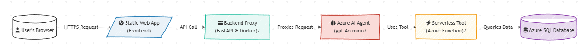

# Full-Stack AI Business Website & Secure Cloud Architecture

Welcome to the central repository for my Full-Stack AI Business Website—a complete, full-stack, AI-powered web application built from the ground up to solve real-world business needs. This project was conceived and executed as a comprehensive portfolio piece to demonstrate a deep, practical understanding of modern cloud architecture, full-stack development, enterprise-grade AI integration, and rigorous security best practices on Microsoft Azure.

The application serves as an intelligent customer service portal for a small business, providing a seamless user experience with two core, AI-driven features:

1.  **🤖 AI-Powered Conversational Q&A:** An intelligent agent that accurately answers questions about business services, pricing, and processes by querying a private knowledge base.
2.  **🔍 Live, Typo-Tolerant Order Status Lookups:** A robust tool that allows customers to look up their order status in real-time against a secure database, even with minor spelling errors.

---

## 🚀 Live Application & Video Demonstration

Actions speak louder than words. You can interact with the live, deployed application and watch a short walkthrough of its features. This demonstrates not just the concept, but a fully realized and deployed product.

-   **[➡️ Interact with the Live Demo Here](https://proud-ground-0066a270f.6.azurestaticapps.net)**
-   **🎥 Watch the Video Walkthrough Below:** This short, animated GIF showcases the application's key features in a continuous loop, providing immediate proof of functionality.

---

## 🏛️ Architectural Philosophy & Design

This application was architected with three core principles in mind: **Security, Scalability, and Maintainability**. It employs a modern, decoupled design where a static frontend communicates exclusively with a custom Python backend. This backend serves as a **secure proxy and intelligent orchestrator**, ensuring that no sensitive credentials, business logic, or complex integrations are ever exposed to the client-side.

### High-Level Logical Flow

This diagram illustrates the journey of a user's request through the system's primary components, showing how data flows from the user to the database and back.

### Detailed Network & Security Architecture

For a deep dive into the physical network topology, VNet configuration, private endpoints, and the "zero-trust" security model, please see the full architecture document. This document is intended for a technical audience interested in the infrastructure and security implementation.

-   **[➡️ View Detailed Network & Security Architecture](./docs/ARCHITECTURE.md)**
---

## 💡 Key Features & Technical Decisions

This project is more than just a collection of technologies; it's a series of solutions to common engineering challenges, showcasing a deep understanding of modern software development principles.

### 1. Security-First Infrastructure
Security was not an afterthought; it was the foundation of the architecture, implemented through a multi-layered, "defense-in-depth" strategy.

-   **Secure Gateway (BFF Pattern):** The FastAPI backend acts as a hardened gateway (Backend for Frontend). By abstracting all backend services, it presents a single, controlled API surface to the frontend, drastically reducing the potential attack surface and preventing direct client access to sensitive services.
-   **Passwordless Cloud Architecture:** All service-to-service communication within Azure is authenticated using **Azure AD Managed Identities**. This modern, best-practice approach completely eliminates the risk of leaked secrets by removing them entirely from code and configuration. This applies to the App Service connecting to the AI Agent and the Function connecting to the database.
-   **API Abuse & Cost Control:** The public-facing API is protected against denial-of-service and cost-overrun attacks through two mechanisms: **API Rate Limiting** at the application layer (`slowapi`) and a hard **TPM (Tokens-Per-Minute) Quota** on the Azure OpenAI model itself.
-   **Network Isolation:** As detailed in the architecture document, critical data services like Azure SQL are placed within a VNet and are only accessible via **Private Endpoints**, making them completely inaccessible from the public internet.

### 2. Full-Stack Engineering Proficiency
This project demonstrates end-to-end development capabilities, from the user's browser to the database.

-   **Modern Frontend:** A clean, responsive UI built with **vanilla JavaScript**, showcasing mastery of modern web standards like `async/await`, the `fetch` API, and secure DOM manipulation (`.innerText` to prevent XSS attacks). The user experience is designed to be intuitive, with clear loading states and error feedback.
-   **Asynchronous Backend:** A robust, high-performance API built with **FastAPI**. Its use of **Pydantic** for data modeling provides automatic, out-of-the-box request validation, ensuring data integrity and API stability. The entire backend is asynchronous, making it highly efficient.
-   **Reproducible Environments (Containerization):** The backend is fully containerized with **Docker**, guaranteeing a consistent and reproducible environment that works identically on a local machine and in the cloud on Azure App Service.

### 3. Advanced AI & Microservice Integration
The AI is not just a chatbot; it is an orchestrated agent capable of performing real tasks through a decoupled architecture.

-   **AI Orchestration:** An **Azure AI Agent** built on `gpt-4o-mini` manages the conversational flow. It can leverage a knowledge base for RAG (Retrieval-Augmented Generation) or use custom tools to interact with other systems.
-   **Advanced Prompt Engineering:** The agent's behavior is guided by a detailed, multi-step system prompt. This prompt defines its persona, enforces strict operational boundaries (guardrails), dictates a precise response format, and includes rules for data privacy and error handling.
-   **Decoupled Microservice:** The typo-tolerant database query logic is intentionally isolated in a dedicated, serverless **Azure Function**. This is a classic microservice pattern that improves scalability (the function scales independently), maintainability (it can be updated without touching the main backend), and separation of concerns.
    -   **[➡️ View the code for this microservice in its separate repository.](https://github.com/dawsonsallee/sallee-agent-tools)**

---

## 🛠️ Project Evolution & Real-World Problem-Solving

A key goal of this project was to move beyond tutorials and solve the messy, unexpected problems that arise in real-world cloud development. This journey demonstrates advanced debugging, critical thinking, and architectural adaptability.

-   **The Agent Endpoint Pivot:** The initial plan to call the AI Agent directly from the frontend was blocked by platform limitations (no simple REST endpoint). **Solution:** This constraint led to a superior design. I architected and built the secure backend proxy, a more robust and professional pattern that enhanced security and control.
-   **The Silent Deployment & Data Corruption Bug:** I encountered a multi-layered bug where a deployed Azure Function was not updating and was sending corrupted data (`None` values instead of `0.0`), causing the main API to crash. **Solution:** After diagnosing the deployment issue, I implemented **defensive programming** in the backend proxy to sanitize the data from the upstream microservice. This made the entire system more resilient to failures in its dependencies.
-   **The IAM & Security Hardening Cascade:** A full security audit to implement a "zero-trust" network (using firewalls and Managed Identities) triggered a complex chain of `403 Forbidden` errors. **Solution:** I methodically diagnosed the issue by analyzing cloud-native logs (Azure Monitor, Log Streams), ultimately identifying a deep, non-obvious root cause: a missing `Storage Table Data Contributor` IAM role required by the Azure Functions runtime itself. This demonstrated an ability to debug across the entire cloud stack, from application code to infrastructure permissions.
---

## 💻 Technology Stack

This project leverages a modern, cloud-native technology stack, demonstrating proficiency across various domains of software and AI engineering.

| Category          | Technology / Service                                     | Purpose & Key Skills Demonstrated                               |
|-------------------|----------------------------------------------------------|---------------------------------------------------------------|
| **Frontend**      | HTML5, CSS3, JavaScript (Vanilla)                        | Core web fundamentals, responsive design, secure DOM manipulation |
| **Backend**       | Python 3.11, FastAPI, Docker, `slowapi`                  | Asynchronous API development, data validation, containerization |
| **AI**            | Azure AI Studio, Azure OpenAI (`gpt-4o-mini`)            | AI orchestration, prompt engineering, agent & tool creation   |
| **Database**      | Azure SQL Database                                       | Relational data modeling, SQL querying                        |
| **Hosting**       | Azure App Service, Azure Static Web Apps, Azure Functions| Cloud service management, PaaS, Serverless architecture       |
| **CI/CD**         | GitHub Actions (for the Static Web App)                  | Automated build and deployment pipelines                      |
| **Security**      | Azure AD Managed Identity, Private Endpoints, Dependabot | Cloud security, network isolation, passwordless auth, supply chain security |
| **Libraries**     | `Pydantic`, `httpx`, `pyodbc`, `rapidfuzz`               | Data validation, async HTTP requests, DB access, fuzzy matching |

---

## ⚙️ Local Development & Deployment Strategy

A professional development workflow was maintained throughout the project, including local setup and a multi-faceted deployment strategy.

### Local Development Setup

This repository is a monorepo containing both the `frontend` and `backend` code. To run the project locally, you will need **Python 3.11+** and **Docker Desktop**.

#### Backend (FastAPI Proxy)
1.  Navigate to the `backend` directory: `cd backend`
2.  Create and activate a Python virtual environment.
3.  Install dependencies: `pip install -r requirements.txt`
4.  Create a `.env` file in the `backend` directory for local secrets. This file is correctly git-ignored. Populate it with the necessary endpoints and keys for your local Azure development setup.
5.  Run the local server: `uvicorn main:app --reload`

#### Frontend
The frontend is built with vanilla HTML, CSS, and JavaScript and requires no complex build steps. It can be run using any simple live server. The **[Live Server extension](https://marketplace.visualstudio.com/items?itemName=ritwickdey.LiveServer)** for VS Code is recommended. Remember to point the API constants in the `.js` files to your locally running backend for testing.

### Deployment Strategy

The application is deployed to Azure using a hybrid strategy that reflects a real-world scenario where different components have different deployment needs and lifecycles.

-   **Frontend (CI/CD):** Deployed via **Azure Static Web Apps**. This service is linked directly to this GitHub repository. A **GitHub Actions** workflow automatically builds and deploys any changes pushed to the `main` branch, demonstrating a modern Continuous Integration/Continuous Deployment practice.
-   **Backend (Containerized):** The Dockerized FastAPI application is deployed to **Azure App Service for Containers**. The manual deployment process involves building the Docker image, pushing it to a private **Azure Container Registry (ACR)**, and then updating the App Service to pull and run the new image tag.
-   **Serverless Tool:** The Azure Function is deployed directly from its own repository using the Azure Functions extension in VS Code, showcasing a typical microservice deployment workflow.
  
