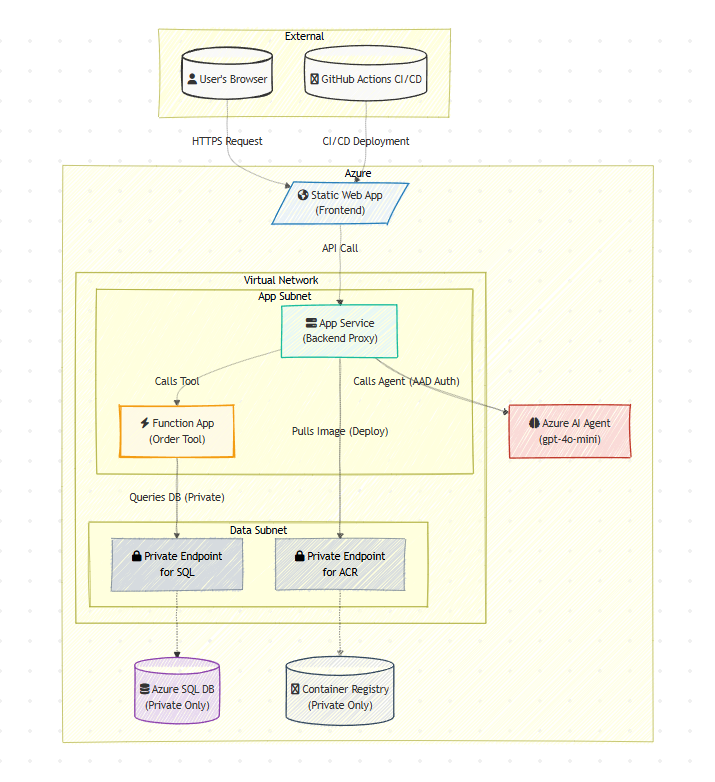

# Detailed Project Architecture: Network & Security

This document provides a detailed, physical view of the application's cloud architecture on Microsoft Azure. It is intended for a technical audience and focuses on the network topology, security boundaries, and data flow between services.

## Level 3 (Physical/Network) Diagram

## Security & Network Design Principles

This architecture was designed with a "defense-in-depth" and "zero-trust" security posture.

-   **Virtual Network (VNet):** The core of the security model is a private Virtual Network that isolates all sensitive backend components from the public internet.

-   **Private Endpoints:** To eliminate data exfiltration risks, all data-centric PaaS services (Azure SQL and Azure Container Registry) are accessed via **Private Endpoints**. This gives them a private IP address inside our VNet, meaning all communication between the application and the data happens over the secure Azure backbone, never over the public internet. The firewalls on these services are configured to **deny all public access**.

-   **VNet Integration:** Both the **App Service** and the **Function App** are configured with VNet Integration. This allows their outbound traffic to originate from within the VNet, enabling them to connect to the private endpoints.

-   **Managed Identities:** All service-to-service authentication within Azure is handled using **passwordless Managed Identities** and Azure Active Directory. This is the modern standard for cloud security, as it eliminates the risk of leaked credentials or secrets stored in code.

-   **Minimal Public Exposure:** The only publicly accessible ingress points are the **Static Web App** (for users) and the **App Service** (for API calls). All other components are shielded within the private network.